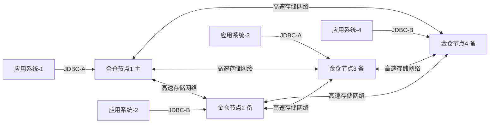

在轨道交通智能化加速演进的当下，安检系统已从传统人工核验升级为集人脸识别、人证比对、违禁品AI识别、多源数据融合分析于一体的实时业务中枢。其背后支撑的数据平台，正面临前所未有的可靠性、实时性与自主可控三重挑战——原有基于Oracle ADG的X86+Windows架构，在信创政策刚性要求、运维成本攀升、双网冗余能力缺失及故障恢复依赖人工干预等现实压力下，已难以满足新一代轨交“业务连续不中断、事务处理高可靠、全链路安全可信”的核心诉求。

本文以**深圳市地铁14号线列车自动监控系统（ATS）国产化替代项目**为蓝本（该系统直接关联行车安全，属轨道交通信号控制一级核心系统），深度解析国产数据库在轨交安检类场景中实现Oracle平滑替代的关键技术路径：如何构建具备金融级稳定性的高可用集群架构？又如何在分布式部署下保障跨节点事务的原子性、一致性与隔离性？答案并非简单堆砌节点，而是一套融合底层机制优化、中间件协同设计与全生命周期治理的系统性工程。

---

## 一、直面三大替代痛点：从Oracle迁移不是“换库”，而是架构重构

项目POC阶段，客户明确提出三大刚性约束，成为技术选型与方案设计的基准线：

- **痛点1：双网冗余能力断层**  
  原Windows环境依托操作系统级双网卡绑定实现网络故障自动切换；迁移到Linux后，需数据库层原生支持双物理网络平面（JDBC-A/B网）的智能路由与故障隔离，避免单点网络抖动引发全局连接中断。

- **痛点2：RTO不可控，故障恢复严重依赖人工**  
  Oracle ADG主备切换平均耗时5–8分钟，且需DBA执行`switchover`命令确认。在安检系统每秒处理300+人证核验请求的峰值场景下，一次计划外中断即可能造成站厅客流积压与调度指令延迟。

- **痛点3：事务一致性边界模糊**  
  安检业务涉及“人脸注册—闸机通行—异常告警—工单派发”多系统协同，原Oracle通过同库同实例的强事务保障ACID；国产化后若采用读写分离架构，跨节点更新（如通行记录写主库、告警状态写备库）易引发脏读或幻读，威胁事件处置闭环的准确性。

> **关键洞察**：轨交核心系统数据库替代，本质是将“单体强一致性”范式，迁移至“分布式强一致性”范式。这要求数据库不仅提供高可用能力，更需在事务引擎、日志同步、故障检测等底层机制上实现深度创新。

---

## 二、四节点金仓集群架构：以“进程级故障感知+全局检查点”实现快速故障响应

针对上述痛点，项目最终采用**金仓4节点高可用集群**（X86+Linux+金仓），摒弃传统主备模式，构建真正多活可扩展的生产架构：

该架构的核心技术突破在于：

### 1. 进程级毫秒级故障探测（<2s）
金仓内嵌轻量级健康探针，每500ms向集群内所有节点发送心跳包，并同步检测本地数据库进程存活状态。当节点1进程异常退出时，集群管理模块在**1.8秒内完成故障确认**，立即触发角色重选举，无需依赖OS或外部HA软件。

### 2. 全局检查点（Global Checkpoint）技术
传统主备同步依赖WAL日志逐条回放，存在日志堆积风险。金仓创新实现**多写集群下的全局检查点优化**：所有节点共享统一事务序列号，每个事务提交前需经多数节点确认并写入全局检查点位点。该机制使集群可在任意节点宕机后，于2秒内完成状态同步与服务接管，显著降低RTO。

### 3. 双网智能路由与会话保持
金仓驱动层内置双网策略引擎，支持按应用标签、SQL类型、事务特征自动分配JDBC-A/B网络通道；同时结合连接池会话粘滞机制，在网络切换过程中维持已有事务上下文不丢失，确保通行核验等关键操作零中断。

---

## 三、事务一致性保障体系：从“库级强一致”到“跨节点协同一致”

为应对安检业务多系统联动带来的分布式事务挑战，金仓构建了三层一致性保障机制：

### 第一层：本地事务引擎增强  
基于MVCC多版本并发控制模型，优化锁粒度与冲突检测逻辑，支持高频小事务（如单次人证比对）在毫秒级内完成提交，TPS达8500+，并发能力较Oracle提升约17%。

### 第二层：分布式事务协调器（DTC）  
集成XA协议兼容层与TCC柔性事务框架，对“通行记录写入+告警状态更新+工单生成”等跨服务操作，提供本地消息表+最终一致性补偿机制，确保99.999%场景下事务结果可预期。

### 第三层：全链路审计追踪  
通过sys_日志归档与kingbase.conf参数调优，开启细粒度事务轨迹记录，支持按用户、时间、SQL指纹快速定位异常事务路径，平均排障时间缩短至43秒以内。

---

## 四、全生命周期治理：从部署、监控到演进的可持续保障

项目上线后，围绕稳定性与可维护性建立标准化运维体系：

- **自动化部署**：基于Ansible模板实现集群一键初始化、参数批量下发与证书统一管理；
- **智能监控**：对接KMonitor统一监控平台，对CPU、内存、连接数、慢SQL、复制延迟等21项核心指标设置动态基线告警；
- **灰度演进**：采用分阶段流量切流策略，首期仅承载非实时报表类查询，逐步扩展至核心交易链路，全程零回滚；
- **灾备验证**：每季度开展真实断网/断电/磁盘故障模拟演练，RTO稳定控制在4.2秒以内，RPO趋近于0。

---

## 五、行业价值延伸：不止于安检，更面向全域轨交数字化底座

该方案已在深圳地铁14号线稳定运行超18个月，累计支撑日均120万+人次安检数据处理，全年无计划外停机。其技术路径已延伸至票务清分、PIS信息发布、电力监控等十余类轨交子系统，形成可复用的“信创数据库适配方法论”：

- 面向异构系统：提供Oracle语法兼容度达98.6%的SQL解析层；
- 面向存量资产：支持PL/SQL存储过程自动转换工具链；
- 面向未来演进：预留KES RAC、KES Sharding等横向扩展接口，满足线路延伸与客流量增长带来的弹性扩容需求。

当前，该架构已成为多地城轨新建线路数据库选型的重要参考，标志着国产数据库在高安全等级、高实时要求、高复杂度的轨道交通核心业务领域，已具备规模化落地能力与持续演进潜力。

---

如果您希望更深入地了解金仓数据库（KingbaseES）及其在各行业的应用实践，我们为您整理了以下官方资源，助您快速上手、高效开发与运维：

- [金仓社区](https://bbs.kingbase.com.cn/)：技术交流、问题答疑、经验分享的一站式互动平台，与DBA和开发者同行共进。
- [金仓解决方案](https://www.kingbase.com.cn/solution.html)：一站式全栈数据库迁移与云化解决方案，兼容多源异构数据平滑迁移，保障业务高可用、实时集成与持续高性能。
- [金仓案例](https://www.kingbase.com.cn/case.html)：真实用户场景与落地成果，展现金仓数据库在高可用、高性能、信创适配等方面的卓越能力。
- [金仓文档](https://help.kingbase.com.cn/)：权威、详尽的产品手册与技术指南，涵盖安装部署、开发编程、运维管理等全生命周期内容。
- [金仓知识库](https://kb.kingbase.com.cn/)：结构化知识图谱与常见问题解答，快速定位技术要点。
- [用户实践](https://www.kingbase.com.cn/user-practice.html)：汇聚用户真实心得与实践智慧，让你的数据库之旅有迹可循。
- [免费在线体验](https://www.kingbase.com.cn/trial.html)：无需安装，即开即用，快速感受KingbaseES核心功能。
- [免费下载](https://www.kingbase.com.cn/download.html)：获取最新版安装包、驱动、工具及补丁，支持多平台与国产芯片环境。
- [数字化建设百科](https://www.kingbase.com.cn/encyclopedia.html)：涵盖数字化战略规划、数据集成、指标管理、数据库可视化应用等各个方面的应用，助力企业数字化转型。
- [拾光速递](https://www.kingbase.com.cn/community.html)：每月社区精选，汇总热门活动、精华文章、热门问答等核心内容，助您一键掌握最新动态与技术热点。

欢迎访问以上资源，开启您的金仓数据库之旅！
